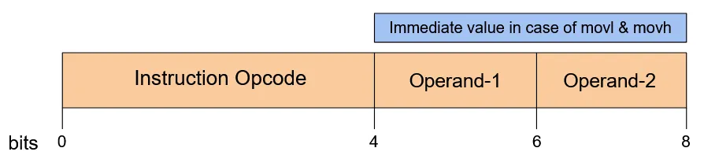

# ISA

## Registers

This ISA uses 4 registers which are all 8 bit in size.

The registers are namely- `R0`, `R1` , `R2`  and `R3` .

Aside from these general purpose registers, we have a special purpose register `PC`  which works as the program counter.

| Register | Purpose | Encoding(in bits) |
| --- | --- | --- |
| PC | Program counter | - |
| R0 | General Purpose | 00 |
| R1 | General Purpose | 01 |
| R2 | General Purpose | 10 |
| R3 | General Purpose | 11 |

## Memory

We are using an 8-bit memory, where each 8-bit address stores a Byte. There are 2 separate memories - 1 for data and other for program code.

The data memory is byte-addressable. We have refer to 2^8 bytes. Hence, it is 256B in size. The instruction memory is 2^16 (64KB) in size. Hence, we can have 2^16 instructions in a program. 

## Flags

| Flag | Description |
| --- | --- |
| ZF | set if the result is 0 |
| NF | set if result is negative |
| EF | set if exception is raised |
| HF | set if program needs to end |

The above 2 flags will be set by the cmp( Compare ) instruction and then will be used by jgt(  Greater Than Condition Jump ) or je( Conditional Jump ) instruction.

## Instructions

There are total **16** instructions present in this ISA.

### Arithmetic Instructions

| Instruction | Description | Example (assembly) | Encoding (bits) |
| --- | --- | --- | --- |
| add | adds the values in the 2 registers and stores in 1st one | add R0, R1 | 0000 |
| sub | subtracts the value in 2nd register from 1st one and stores in 1st one | sub R0, R1 | 0001 |
| mul | multiplies the 2 registers and stores the result’s most significant 8 bits in `R1` and least significant 8 bits in `R0`  | mul R1, R2 | 0010 |
| div | divides the 1st register by 2nd and stores the quotient in `R0` and remainder in `R1`  | div R2, R3 | 0011 |

### mov Instructions

| Instructions | Description | Example (assembly) | Encoding(bits) |
| --- | --- | --- | --- |
| mov | Copies the data from 2nd register to 1st | mov R1, R2 | 0101 |
| movl | Copies the next 4 bits of Immediate value into lower 4 bits of `R0`  | movl $a | 0110 |
| movh | Copies the next 4 bits of Immediate value into higher 4 bits of `R0` | movh $0 | 0111 |

One important thing to note is that to store an 8-bit value in a register, we will have to first move the lower 4 bits by using movl and the upper 4 bits by movh.

### Memory-related Instructions

| Instruction | Description | Example (assembly) | Encoding(bits) |
| --- | --- | --- | --- |
| ld | The second register (here `R3`)  contains the 8-bit address. This instruction loads the value stored at that address into the first register (here `R2`). | ld R2, R3 | 1100 |
| st | Stores the value present in second register(here `R3`) into the address present in first register (here `R2`) | st R2, R3 | 1101 |

### Bitwise Instructions

| Instruction | Description | Example (assembly) | Encoding(bits) |
| --- | --- | --- | --- |
| nand | Bitwise nand 1st with 2nd operand and store result in 1st. This instruction will be used to perform bitwise instructions like AND, OR, NOT and XOR using a combination of multiple `nand` instructions. | nand R0, R1 | 0100 |

### Branching and misc. Instructions

| Instruction | Description | Example (assembly) | Encoding(bits) |
| --- | --- | --- | --- |
| jmp | Unconditional jump | jmp R2, R3  | 1000 |
| je | jump if equal to | je R1, R0 | 1001 |
| jgt | jump if greater than | jgt R1, R2 | 1010 |
| cmp | subtract 2nd from 1st and set flags | cmp R1, R0 | 1011 |

First register will have the 8 most significant bits and second will have the 8 least significant bits of the offset to be jumped in the instruction memory.

### System Instructions

| Instruction | Description | Example(assembly) | Encoding(bits) |
| --- | --- | --- | --- |
| syscall | used to perform various operations as read, write, etc. `R0`  specifies the syscall number (0 for write and 1 for read), `R2` contains the address where it is written, `R3` contains the number of bytes to deal with. | syscall | 1110 |
| hlt  | stops the execution | hlt | 1111 |

### Instruction encoding

The first 4 bits of the 8 bit fixed length instruction represent the opcode for the instruction.

The next 2 bits represent the register to be used as 1st operand.

The next 2 bits represent the register to be used as 2nd operand.

Exception: In the case of of `movu` and `movl` instruction, the last 4 bits represent immediate.

### Some examples

1. `mov R0,R3` 
    - `1101 00 11`
2. `st R0,R2`
    - `1100 00 10`
3. `movl 4`
    - `1110 0100`