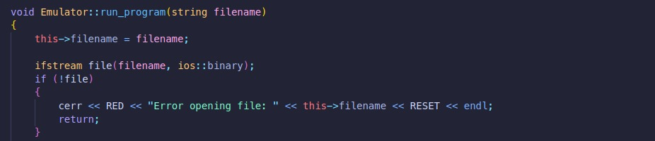
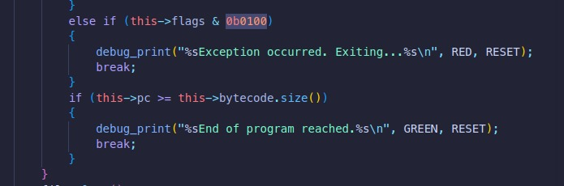
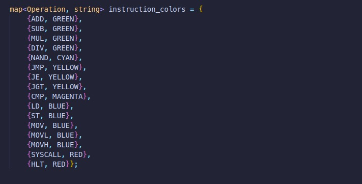

# Documentation

This document tells about the way we made the project. It gives a comprehensive overview of all the “how” and “why” questions related to the project.

## ISA-Fix8

This part explains the reasons and thought process of the specific decisions taken while making the ISA which we have named fix8.

Our target is to make a fixed length 8-bit ISA. The main problem which we have to solve while making the ISA is that we have a constraint of 8-bits which automatically limits the following things:

1. Number of instructions and their functionality
2. Number and size of registers, which limits the immediate size
3. Types of addressing modes.
4. Size of memory in all respects (data memory, instruction memory, length of word).

So our target is to optimize the size of memory, number & size of registers and the number of instructions under the constraint of its 8-bit size. In essence, we have to try make a nearly Turing complete ISA with this constraint.

### *Instructions*

Number of instructions ≤ 2^i , where i = number of bits used for opcode in the instruction encoding.

So with a limited number of bits, we will have to go for a limited number of instructions which too would be very necessary ones.

After some brainstorming process on deciding ‘i’ we came to the decision that i = 4 would be optimal. So number of instructions = 16.

Intuitively, it is clear that the following 8 instructions have to be present there for an ISA:

1. Arithmetic instructions : add, sub, mul, div
2. Memory related : mov, st, ld
3. Ending the program: hlt (halt)

We would have stopped here with 2^3 = 8 instructions, but it would have made a very trivial calculator and not an ISA

Now for other requirements like if-else statements and loops, we require these 4 instructions: cmp, jmp, jgt, je.

So we have decided 12 out of the 16 instructions.

Now we need something to perform bitwise operations i.e. AND, OR, NOT & XOR.

We would have made 4 instructions, 1 for each of these. But we came with a great idea of making an instruction for bitwise NAND, which is the universal gate. So all the above bitwise operations can be performed by using a combination of NAND operations. So we saved 3 instructions by this smart move.

The immediate size that we can have is 4 bits (after using 4 bits for opcode). This makes the register size 4. But this would be very small. So we made 2 more instructions ‘movl’ and ‘movh’ which load the immediate to `R0`'s lower and upper 4 bits respectively. This enables us to make the register size 8 bits.

Now we are remaining with 1 more instruction, which we decided to have ‘syscall’. This will enable us to take text inputs give text outputs. This makes our ISA more Turing complete.

So this becomes the complete set of instructions of Fix8.

### *Registers*

The number of registers = 2^r , r = number of bits used to encode the registers. we have to minimize r and hence the number of registers.

Also, we are remaining with 4 bits only after using 4 bits for the opcode.

We would need at least 4 registers even for doing basic tasks. So we would require 2 bits for encoding the register. This gives us another facility (which is a need) that we would be able to give 2 operands with an instruction. 

The smart move of making ‘movl’ and ‘movh’ instructions enabled us to make the register size = 8.

### *Memory*

The memory is linear. A nicely big memory is required to be able to execute complex programs. So we have to optimize the memory size.

The size of word at each address becomes 8 bit by the virtue of register size.

The memory would have had been 4-bit (4-bit address of each word), because of immediate size, but we changed the addressing mode of ‘ld’ and ‘st’ functions (can be seen in the ISA definition) which enabled us to have an 8-bit memory by the virtue of register size of 8-bits.

We have kept the data memory and instruction memory separate. The above lines were about the data memory.

We could have made the instruction memory 8-bits as the offsets in instruction memory will be used by the jump instructions. But we made the jump instructions - ‘jmp’, ‘jgt’ and ‘je’ take 2 operands, which allowed us to make the instruction memory 16-bit and size of each word 8 bits.

We also tried for a data memory of 16-bits, with some change in instructions by using logical shift left, but it failed in executing some basic programs like if-else. Hence we rejected that model.

In this way, we finally came up with an 8-bit 256 B data memory and a 16-bit 64 KB instruction memory.

## Assembler

### Overview

The assembler is a simple program that translates assembly code into machine code. It reads an assembly file, tokenizes each line, and generates a binary file containing the machine code.

### Features

- *Instruction Parsing*: The assembler parses each line of the assembly code, tokenizes it, and identifies the instruction and its operands.
- *Operand Handling*: Different operand types (registers, immediate values) are handled by specific functions.
- *Error Handling*: The assembler provides detailed error messages with line and column numbers.
- *Binary Output*: The assembler generates a binary file containing the machine code.

### Execution Flow

1. *Main Function*:
    - The main function in src/main.cpp presents a menu to the user with options to assemble a program, emulate a program, or exit.
    - If the user chooses to assemble a program, the assemble_file function is called with the selected assembly file and the output binary file name.

2. *Assemble File*:
    - The assemble_file function in src/main.cpp creates an Assembler object and calls its assemble method with the assembly file name.
    - The assemble method reads the assembly file line by line and processes each line using the parse_line method.

3. *Parse Line*:
    - The parse_line method in include/assembler.cpp tokenizes the line and calls parse_instruction to identify the instruction and its operands.
    - If the instruction is valid, it generates the corresponding machine code and adds it to the machine_code vector.

4. *Parse Instruction*:
    - The parse_instruction method in include/assembler.cpp identifies the instruction format (R-type, I-type, or N-type) and calls the appropriate operand parsing function (parse_operands_rtype, parse_operands_itype, or parse_operands_ntype).

5. *Operand Parsing*:
    - The operand parsing functions (parse_operands_rtype, parse_operands_itype, parse_operands_ntype) extract the operands from the tokens and populate the Instruction object with the appropriate values.

6. *Error Handling*:
    - If any errors are encountered during parsing, the handle_error method is called to display an error message with the line and column numbers.

7. *Binary Output*:
    - Once all lines are processed, the assemble method returns the machine_code vector.
    - The assemble_file function writes the machine_code to the output binary file.

8. *Completion*:
    - The assemble_file function prints a success message indicating the location of the output binary file.

## Emulator

### Introduction

To validate the functionality of our assembler, we developed an emulator capable of executing the assembled code. This emulator facilitates thorough testing and debugging by simulating the execution of programs.

### Overview

The emulator is implemented in C++, leveraging modern features for simplicity and efficiency. It interprets the bytecode produced by the assembler and simulates a simple processor's behavior.

### Execution Flow

1. **Initialization**: When the "Emulate" option is selected and a program is specified, the emulator checks for the file's existence. If the file exists, it opens the file and reads all the bytes into memory.

2. **Main Loop**: The emulator enters a `while(true)` loop to execute the program instructions sequentially. Since each instruction is one byte, the decoding logic remains straightforward. The emulator reads a byte, decodes it into an opcode and operands, and creates an `Instruction` object.

3. **Instruction Execution**: The `Instruction` object is passed to the `execute` function, the core of the emulator, which interprets and simulates the instruction, modifying the emulator's state accordingly.

4. **Termination**: The execution continues until the `hlt` flag is set, signaling the emulator to exit the loop and terminate the program.

## Exception Handling

Robust exception handling is crucial for extending the emulator's capabilities. The emulator includes the following mechanisms:

- **File Handling**: Before opening the file, the emulator verifies its existence. If the file does not exist, it outputs an error message and terminates gracefully.

    

- **Invalid Operations**: If an invalid opcode is detected or an invalid system call is attempted, the emulator prints a warning and sets an `exception flag`. The main loop checks this flag, and if it's set, the emulator exits the execution loop.

    

### Visualization Enhancements

To enhance readability and visualization, the emulator uses specialized color coding for different instruction groups. This feature helps users easily differentiate between various operations during debugging and analysis.

